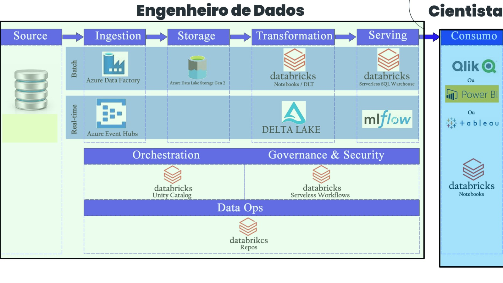

# Ingerir dados com fluxos de dados Gen2 no Microsoft Fabric

## Introdução 

- Engenharia de dados: A parte que prepara os dados para serem enviados para um Cientista de dados.

- Cientista de dados: Quem recebe os dados para fazer visualização no Power BI ou modelos preditivos.

Nesse módulo sera ensinado o modelo de dados Gen2.

## Entender fluxos de dados Gen2 no Microsoft Fabric

### Dicionário

- **Lakehouse**: Uma arquitetura de dados moderna que cria uma única plataforma combinando os principais benefícios dos data lakes usando tabelas Delta.

- **Data Lake**: É um repositório centralizado projetado para armazenar, processar e proteger grandes quantidades de dados estruturados, semiestruturados e não estruturados.

- **Fluxo de dados**: Processo de ETL em uma pipeline baseada em nuvem que preparar os dados para serem ingeridos no final por um Power BI(Por exemplo).

- **Power Query Online**: Utilizado no Fluxo de dados para fazer o ETL dos dados na pipeline

### Ordem de criação

Workspace -> Lakehouse -> Dataflow Gen2 -> Data Pipeline

### Explicação final

Nessa parte do módulo é vista o processo de ETL utilizando a técnologia dentro do **Synapse Data Engineering** para ETL chamada de **Fluxo de dados Gen2**

## Ingerir dados com o Spark e os notebooks do Microsoft Fabric

### Dicionário

- [Apache Spark](https://www.youtube.com/watch?v=VfpXMuwbQXc): É uma ferramenta que através da clusterização permite juntar poder processamento computacional para análise de dados de grande volumes de dados.

- [PySpark](https://www.youtube.com/watch?v=EMACjF6eCU4): Ferramenta que permite transformar o grande volume de dados em tabelas, é um Pandas para Big Data.

### Gravação em arquivos

Para você gravar de um notebook em um arquivo no **LakeHouse** você precisa de um **ABFS Path**

### Ordem de criação

Workspace -> LakeHouse -> Notebook Fabric

### Explicação final

Nessa parte vêmos o notebook da Fabric que se utiliza dos recursos de clusterização da Azure junto com a alimentação do LakeHouse para fazer as suas análises de dados.

## Usar pipelines no Data Factory no Microsoft Fabric

### Ordem de criação

Workspace -> Lakehouse -> Pipeline

### Pipeline Criada

Delete Data -> Copy Data -> Notebook

- **Delete Data**: Deletar dados de uma pipeline anterior.

- **Copy Data**: Alimentar com dados atualizados a pipeline.

- **Notebook**: Notebook que será alimentado com os novos dados.

### Explicação final

Usando os recursos de **Ingestão e Storage (Lakehouse)**, **Transformation(Fluxo de dados Gen2)** e **Consumo(Notebooks)** podemos construir uma entrega continua de dados. 

